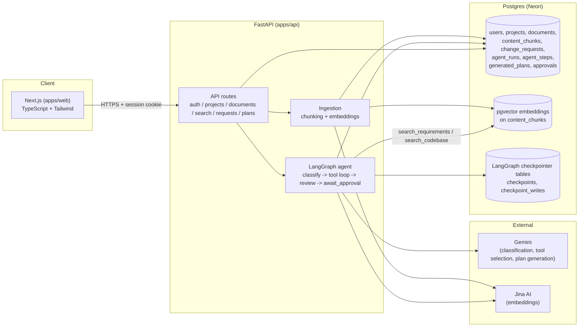
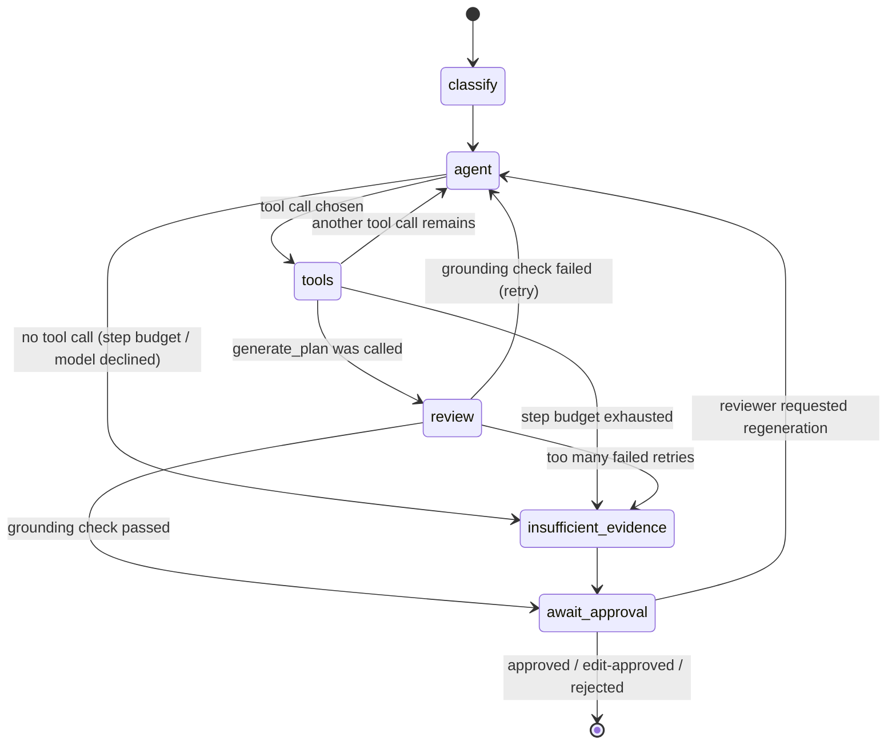

# Architecture

## System diagram

## Agent flow

`await_approval` and the clarification path inside `agent` both use LangGraph's `interrupt()` -
the graph genuinely pauses (persisted via the Postgres checkpointer) and resumes exactly where
it left off once the reviewer (or the requester, for a clarification) responds. This is why a
run's progress survives a server restart, not just a page refresh.

## Why this shape

- **Fixed skeleton, agent-chosen path within it** (BRD 7.2): `classify -> agent loop -> review ->
  await_approval` always runs in that order; the agent only chooses *which tool* to call inside
  the loop, never the overall shape of the workflow.
- **Grounding is enforced in code, not trusted to the model**: `review_node` deterministically
  checks that every `chunk_id`/`file_path` the model cited was actually returned by a search tool
  during this run (see `app/agent/graph.py::_grounding_errors`).
- **No vendor BaaS SDK**: the app talks to Postgres directly through SQLAlchemy/Alembic, even
  though the database is hosted on a managed provider (Neon) - a deliberate BRD constraint to
  build backend depth rather than depend on a managed auth/storage platform.
- **Human approval is structurally required, not optional**: a `generated_plan` only becomes the
  change request's plan of record via an `Approval` row created by `POST /plans/{id}/decision`;
  there is no code path that marks a plan approved without going through that endpoint, and only
  a `reviewer`/`administrator` may call it (see `app/api/deps.py::require_reviewer`).
